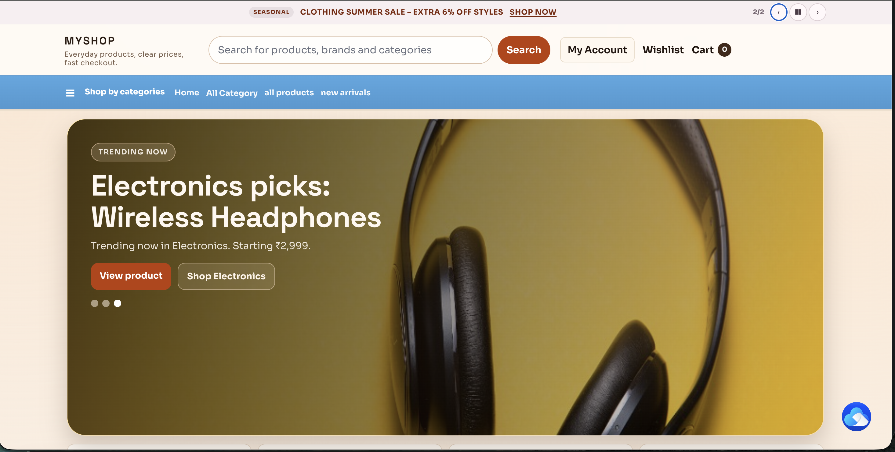
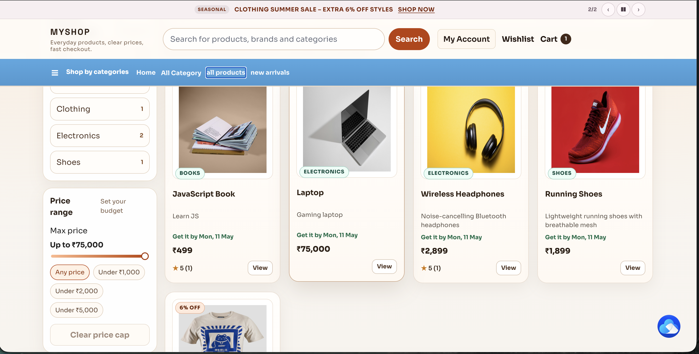
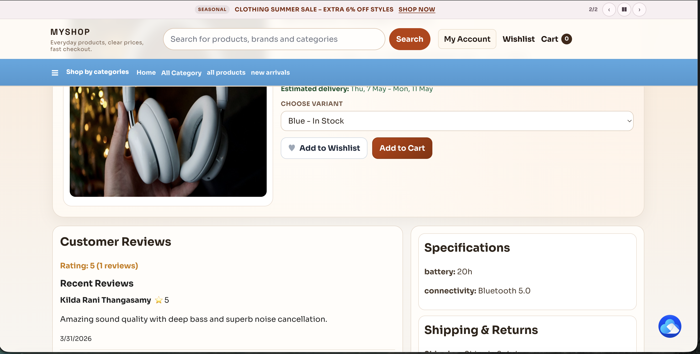
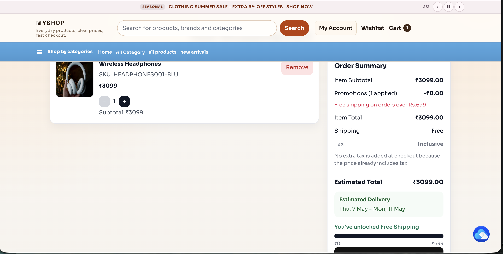
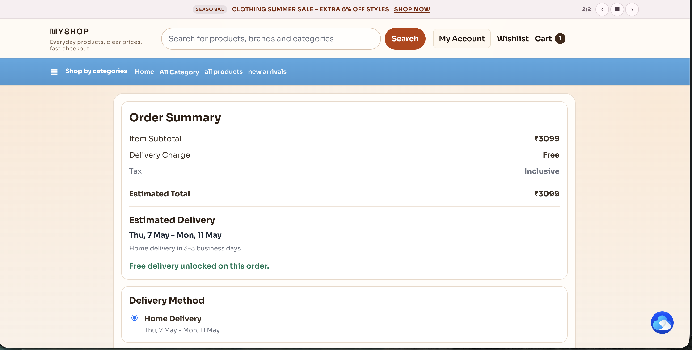
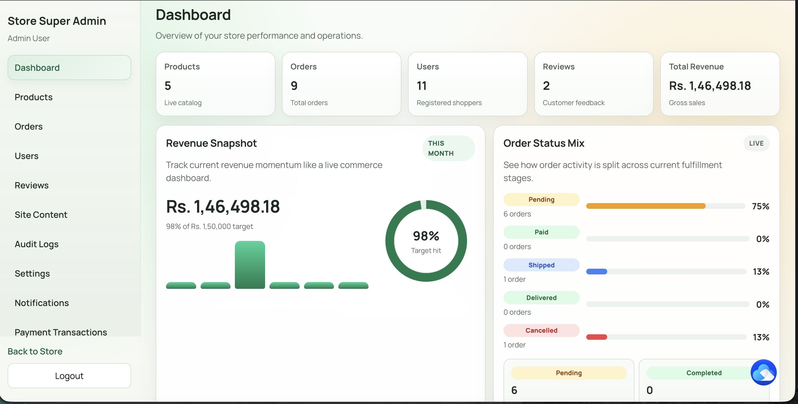
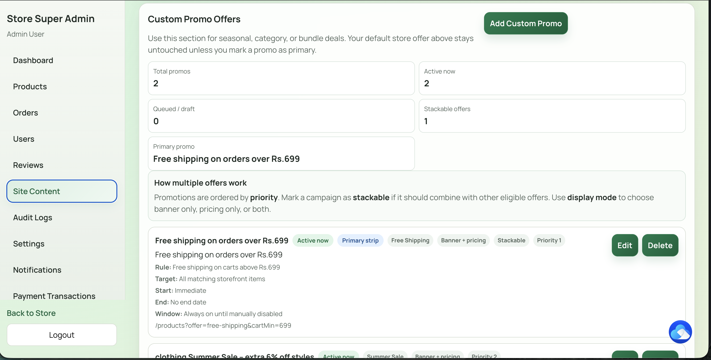

# My Vite App – Ecommerce Project

## 🔗 Live Demo
- **Live Site:** https://my-vite-app-ltkt.onrender.com
- **Admin Panel:** https://my-vite-app-ltkt.onrender.com/login
  - Email: `demo@myshop.com`
  - Password: `Demo@1234`

## 📖 Description
Full‑stack ecommerce site built with **React (Vite)** frontend and **PHP backend**.  
Designed to simulate a real online store with product catalog, cart, checkout, and admin features.

---

## 🛠 Tech Stack
- React.js + Vite (Frontend)
- PHP (Backend REST API)
- MySQL (Database)
- Docker (Backend containerization)
- Render (Hosting - Frontend & Backend)
- Railway (MySQL Database hosting)

---

## ✨ Features
- Product catalog with categories, variants, and search
- Shopping cart & wishlist
- Guest and registered user checkout
- Mock payment gateway integration (Razorpay-style flow)
- Order tracking and order history
- Admin dashboard: manage products, orders, users, reviews, promotions
- Order status workflow (pending → confirmed → shipped → delivered)
- Returns & refunds management
- Responsive design
---

## 🚀 Setup Instructions
1. Clone the repo:
```bash
   git clone https://github.com/kildarani08-spec/my-vite-app.git
```

## 📸 Screenshots


### Homepage


### Product Page


### PDP


### Cart & Checkout



### Admin Dashboard



### Admin Dynamic Offer

